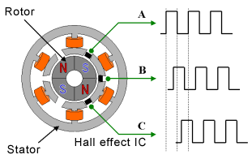

# FOC Troubleshooting

### Overview of control loops
In its most fundamental implementation, field oriented control is a current controller. The controller takes a rotor position and current demand as inputs, and seeks to provide the correct currents through the phases to generate flux perpendicular to the rotor. A PID current controller is used to adjust the duty cycles of the phases to achieve a current demand. In torque control mode, this is the only control loop, since current is directly proportional to torque, while in speed and position control a second control loop adjusts the torque demand to achieve a speed or position demand.

### FOC motor parameters

Flux Linkage is the magnetic flux through a coil, multiplied by the number of turns per coil. This measurement is used in the sensorless observer routine, in order to find the position of the rotor. Even when the controller is not being run in sensorless mode, it will still switch to sensorless at high speeds for better performance.

More information about the math behind sensorless position finding:
http://cas.ensmp.fr/~praly/Telechargement/Journaux/2010-IEEE_TPEL-Lee-Hong-Nam-Ortega-Praly-Astolfi.pdf

Small errors in flux linkage (~10%) can still greatly affect the performance of the motor. This will create instability at high speeds, causing low frequency vibrations and a "knocking" sound. If this happens, try measuring flux linkage again in the FOC settings panel.

If the flux linkage measurement routine fails repeatedly, in can be calculated as follows:

lambda = 60 / (sqrt(3) * pi * kv * pole_num)
http://vedder.se/forums/viewtopic.php?t=131#p693

### ABI encoder

An ABI encoder can be used for commutation. This approach increases the resolution of rotor angle, which allows the motor smoother commutation once moving. However, since the AB signals of an ABI encoder are not absolute, the controller cannot determine the position of the shaft until the motor is turned enough to receive the first index pulse. The current VESC FOC encoder implementation starts the motor at 40% power in senorless mode until the rotor reaches the index position, at which point it will begin using the encoder for rotor position feedback.

### Hall effect

A motor may still turn even with an incorrect hall configuration. This will cause excessive heat dissipation and instability. Continuing to run the motor in this state is highly inefficient, and can burn out windings and/or damage the controller. The best way to determine if this is occurring is by examining the phase current or BEMF plots and looking for erratic behavior.

Each column of the hall table is the enumeration of a combination of hall inputs
>column number = hall1 | hall2 << 1 | hall3 <<2

The values in each column correspond to the average electrical angle at which that combination of hall outputs is observed. Instead of an angle between 0 and 360, these values are scaled to a range of 0 to 200, so that they fit into a single byte. A value of 255 represents a failure to detect that combination at any angle.

The hall effect sensors in a normally operating motor are three 120 degree offset square waves, as shown in the figure below:

As shown in the figure, there is never a point where the hall effect sensors are all on or all off. As a result of this, column zero and column seven on the hall tables should always fail to detect in a normally operating motor, i.e. the first and last columns in the table should always have a value of 255 in FOC mode.

If any other values are in these positions, they can clue you into what is wrong with your system.

#### Common problems:
---
Failure mode: Only column 0 succeeds

Example:

| Col 0 | Col 1 | Col 2 | Col 3 | Col 4  | Col 5 | Col 6 | Col 7 |
|--------|-------:|-------:|-------:|------:|-------:|-------:|------:|
| 0-200 | 255 | 255 | 255 | 255 | 255 | 255 | 255 |

Cause: Hall effect sensors are never at a logic level high.

Solution: Check that the hall effect cable is connected, and that it is getting 5V through the power pin. If problems persist, check the voltages of the individual hall sensor inputs at the VESC, using an oscilloscope. They should oscillate when the motor is turned. 

---
Failure mode: One or more failures between Col1 and Col6

Example:

| Col 0 | Col 1 | Col 2 | Col 3 | Col 4  | Col 5 | Col 6 | Col 7 |
|--------|-------:|-------:|-------:|------:|-------:|-------:|------:|
| 255 | 0-200 | 255 | 255 | 0-200 | 0-200 | 255 | 255 |

Cause: One or more hall effect sensors are not connected or not responding

Solution: Check the continuity of the individual hall effect sensor lines, and verify that they all oscillate between high and low voltage when the motor is turned. Note that even a single non-responsive hall effect sensor will usually cause multiple columns to fail, since any combination including that hall effect sensor at a logical high will never occur. The above table shows a characteristic table of a non-responsive hall #2.

---

Failure mode: Only column 7 succeeds

Example:

| Col 0 | Col 1 | Col 2 | Col 3 | Col 4  | Col 5 | Col 6 | Col 7 |
|--------|-------:|-------:|-------:|------:|-------:|-------:|------:|
| 255 | 255 | 255 | 255 | 255 | 255 | 255 | 0-200 |

Cause: Hall effect sensors are always at a logic level high.

Solution: This probably indicates the hall effect sensors were fried, possibly by reversing the polarity of   power and ground. Replace motor.
